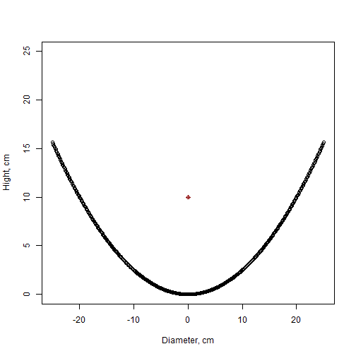

## Purpose

With this app you can evaluate geometry of simple parabolic reflector for 
various implementations:
* Increase signal strenghth of LTE/3G Modem
* Convert wi-fi antenna to be monodirectional
* Build long distance (100-1000m) wi-fi bridge

--- .class #id 

## Under the hood

* Shiny performs a very simple calculation based on square equiation
* Code as below


```r
    ## input parameters
    x <- input$dishsize
    f <- input$focus
    ## empty data frame for plotting
    df <- data.frame(x=numeric(),y=numeric(), stringsAsFactors=FALSE)
    ## evaluating parabola centered to 0
    for (i in seq(-x/2, x/2, by=0.1)) {
            y = i^2/(4*f)
            k <- c(i,y)
            df <- rbind(df, k)
    }
    plot(df, ylim=c(0,25), xlab="Diameter, cm", ylab="Hight, cm")
    ## Plotting focus
    points(0, f, col = "dark red", pch=10)
```

--- .class #id  

## Evaluation example 

* D=50cm, f=10cm



--- .class #id  

## Try it now!

* App is pulished on shinyapps.io
* visit now: https://tony100500.shinyapps.io/parabolic2/


